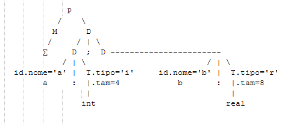

# Construção Tabela de Símbolos

**exemplo:** 
- reconhece declarações de variáveis 
- gera tabela de símbolos

**P ::=** MD
**M ::=** ∑ {desloc = 0}
**D ::=** D ; D
**D ::=** id : T {addSb (id.nome, T.tipo, desloc) ; desloc=desloc + T.tam}
**T ::=** int {T.tipo=i ; T.tam=4}
**T ::=** real {T.tipo=r ; T.tam=8}
**T ::=** array[num] of T1 {T.tipo=matriz(num.val, T1.tipo) ; T.tam=num.val*T1.tam}
**T ::=** ^T1 {T.tipo=ponteiro(T1.tipo) ; T.tam=4}

desloc = ∅

### Tabela de Símbolos

|-|T|S|-|
|---|---|---|---|
| a | i | ∅ | d |
| b | r | 4 | d |

