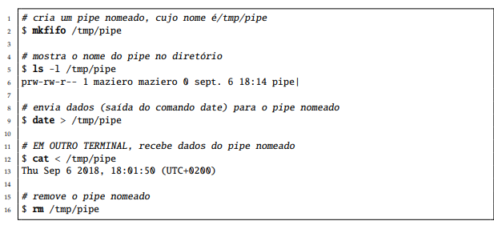
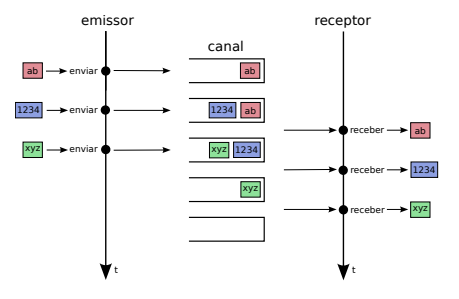

# Interação de Tarefas

---

#### 1. A figura a seguir representa:

- [x] Exemplo da criação de Pipes nomeados
- [ ] Exemplo do pípe em linha de comando

#### 2. Explique o que é espera ocupada e por que os mecanismos que empregam essa técnica são considerados ineficientes.

Espera Ocupada: Ineficiência em Sincronização

Espera ocupada (busy waiting) é quando um processo fica verificando repetidamente se um recurso está disponível, consumindo CPU desnecessariamente. Ineficiente por:
- Alto consumo de CPU (desperdiça recursos)
- Falta de escalabilidade (problema em sistemas com muitos processos)
- Solução simplista (existem mecanismos mais eficientes)

Recomendação: Evite espera ocupada! Opte por mecanismos de sincronização mais eficientes.

#### 3. Para que as tarefas presentes em um sistema possam cooperar, elas precisam comunicar, compartilhando as informações necessárias à execução de cada tarefa, e coordenar suas ações, para que os resultados obtidos sejam consistentes (sem erros).

- [ ] Verdadeiro
- [x] Falso

#### 4. Quatro condições fundamentais são necessárias para que os impasses possam ocorrer:

- [ ] Alocação dinâmica, Exclusão mútua, Preempção e Espera sequencial
- [ ] Posse e espera, Acesso compartilhado, Preempção e Dependência linear
- [ ] Posse e espera, Exclusão mútua, Não-preempção e Espera circular
- [x] Sincronização, Exclusão mútua, Não-preempção e Interdependência cruzada

#### 5. Sobre as afirmações a seguir, relativas aos mecanismos de coordenação, indique quais são incorretas:

- [ ] A estratégia de inibir interrupções para evitar condições de disputa funciona em sistemas multi-processados
- [x] Os mecanismos de controle de entrada nas regiões críticas provêem exclusão mútua no acesso às mesmas.
- [ ] Os algoritmos de busy-wait se baseiam no teste contínuo de uma condição.
- [x] Condições de disputa ocorrem devido às diferenças de velocidade na execução dos processos.
- [ ] Condições de disputa ocorrem quando dois processos tentam executar o mesmo código ao mesmo tempo.
- [x] Instruções do tipo Test&Set Lock devem ser implementadas pelo núcleo do SO.
- [ ] O algoritmo de Peterson garante justiça no acesso à região crítica.
- [x] Os algoritmos com estratégia busy-wait otimizam o uso da CPU do sistema.
- [ ] Uma forma eficiente de resolver os problemas de condição de disputa é introduzir pequenos atrasos nos processos envolvidos.

#### 6. A utilização de memoria compartilhada é uma solução para comunicação entre tarefas situadas em processos distintos deve ser feita através do núcleo, usando chamadas de sistema. Não existe a possibilidade de acesso a variáveis comuns a ambos, pois suas áreas de memória são distintas e isoladas. A comunicação através do núcleo pode ser ineficiente caso seja frequente e o volume de dados a transferir

- [ ] Verdadeiro	
- [x] Falso

#### 7. Apesar da comunicação poder ocorrer entre threads, processos locais ou computadores distintos, com ou sem o envolvimento do núcleo do sistema, os mecanismos de comunicação são habitualmente denominados de forma genérica como:

- [ ] "mecanismos de Distribuição de Recursos" (Resource Distribution Mechanisms).
- [ ] "protocolos de Conexão Direta" (Direct Connection Protocols).
- [ ] "serviços de Gerenciamento de Dados" (Data Management Services).
- [x] "mecanismos IPC" (Inter-Process Communication)

#### 8. Sobre as afirmações a seguir, relativas à sincronização na comunicação entre processos, indique quais são incorretas:

- [ ] Na comunicação semi-bloqueante, o emissor espera indefinidamente pela possibilidade de enviar os dados.
- [ ] Na comunicação síncrona ou bloqueante, o receptor espera até receber a mensagem.
- [x] Um mecanismo de comunicação semi-bloqueante com prazo t = ? equivale a um mecanismo bloqueante.
- [ ] Na comunicação síncrona ou bloqueante, o emissor retorna uma mensagem de erro caso o receptor não esteja pronto para receber a mensagem.
- [x] Se o canal de comunicação tiver capacidade nula, emissor e receptor devem usar mecanismos não-bloqueantes.
- [ ] A comunicação não-bloqueante em ambos os participantes só é viável usando canais de comunicação com buffer não-nulo.

#### 9. Por sua forma de funcionamento, os semáforos oferecem uma solução adequada para os problemas de coordenação entre tarefas pois:

- [x] Eficiência: as tarefas que aguardam o semáforos são suspensas e não consomem processador; quando o semáforo é liberado, somente a primeira tarefa da fila de semáforos é acordada.
- [ ] Segurança: um semáforo pode ser liberado por qualquer tarefa, independentemente de quem realizou a operação down(s).
- [ ] Independência: somente as tarefas que solicitaram o semáforo através da operação down(s) são consideradas na decisão de quem irá obtê-lo.
- [ ] Flexibilidade: semáforos permitem que múltiplas tarefas acessem um recurso simultaneamente para aumentar a eficiência.
- [ ] Justiça: a fila de tarefas do semáforo obedece uma política FIFO, garantindo que as tarefas receberão o semáforo na ordem das solicitações .

#### 10. Sobre as afirmações a seguir, relativas mecanismos de comunicação, indique quais são incorretas:

- [ ] A comunicação indireta (por canais) é mais adequada para sistemas distribuídos.
- [x] Canais com capacidade finita somente são usados na definição de algoritmos, não sendo implementáveis na prática.
- [ ] Na comunicação direta, o emissor envia os dados diretamente a um canal de comunicação.
- [ ] Na comunicação por fluxo, a ordem dos dados enviados pelo emissor é mantida do lado receptor.
- [x] Na comunicação por troca de mensagens, o núcleo transfere pacotes de dados do processo emissor para o processo receptor.

#### 11. Explique o que são condições de disputa, mostrando um exemplo real.

Condições de disputa ocorrem quando dois ou mais processos tentam acessar recursos compartilhados de forma concorrente, levando a resultados inconsistentes devido à ordem imprevisível de execução. Por exemplo, em um sistema de banco de dados, se dois processos tentarem atualizar o saldo de uma conta simultaneamente sem sincronização adequada, pode ocorrer uma condição de disputa, levando a resultados incorretos.

#### 12. Com relação a imagem a seguir, é possivel afirma que ela representa um comunicação:

- [x] baseada em mensagens.
- [ ] baseada em fluxo de dados.

#### 13. A maioria dos sistemas operacionais atuais não oferece mecanismos para o compartilhamento de áreas de memória entre processos (shared memory areas), pois as áreas de memória compartilhadas e os processos que as acessam não podem ser gerenciados pelo núcleo, pois o acesso ao conteúdo de cada área é feito diretamente pelos processos, sem intermediação do núcleo.

- [ ] Verdadeiro	
- [x] Falso

#### 14. Sobre os Mutexes, implementados em muitos ambientes de programação, bibliotecas de threads e até mesmo núcleos de sistema é correto afirmar:

- [ ] proveem uma versão simplificada de semáforos
- [x] dois valores são possíveis: livre (1) ou ocupado (0)
- [ ] podem ser liberados por qualquer thread, independentemente de qual tenha realizado o bloqueio inicialmente.
- [ ] aumentam a eficiência permitindo que múltiplas threads acessem simultaneamente o mesmo recurso.
- [x] abreviação de mutual exclusion

#### 15. Impasses são situações muito frequentes em programas concorrentes, mas também podem ocorrer em sistemas distribuídos e mesmo em situações fora da informática

- [x] Verdadeiro	
- [ ] Falso

#### 16. Em um impasse, duas ou mais tarefas se encontram bloqueadas, aguardando a comunicação entre elas. Em outras palavras, existe influência de entidades externas em uma situação de impasse.

- [ ] Verdadeiro	
- [x] Falso

#### 17. Um dos mecanismos de comunicação entre processos mais simples de usar no ambiente UNIX é o pipe, ou “cano”. Um pipe é um canal de comunicação unidirecional entre dois processos. Na interface de linha de comandos UNIX, o pipe é frequentemente usado para conectar a saída padrão (stdout) de um processo à entrada padrão (stdin) de outro processo, permitindo assim a comunicação entre eles

- [x] Verdadeiro	
- [ ] Falso

#### 18. Um monitor é uma estrutura de sincronização que requisita e libera a seção crítica associada a um recurso de forma transparente, sem que o programador tenha de se preocupar com isso

- [x] Verdadeiro	
- [ ] Falso

#### 19. Sobre as afirmações a seguir, relativas aos mecanismos de comunicação, indique quais são incorretas

- [ ] As filas de mensagens POSIX são um exemplo de canal de comunicação com capacidade nula.
- [ ] A memória compartilhada provê mecanismos de sincronização para facilitar a comunicação entre os processos.
- [x] A troca de dados através de memória compartilhada é mais adequada para a comunicação em rede.
Os pipes Unix são um bom exemplo de comunicação M:N.
- [ ] A comunicação através de memória compartilhada é particularmente indicada para compartilhar grandes volumes de dados entre dois ou mais processos.
- [ ] As filas de mensagens POSIX são um bom exemplo de canal de eventos
- [x] Nas filas de mensagens POSIX, as mensagens transitam através de arquivos em disco criados especialmente para essa finalidade.
- [ ] Em UNIX, um pipe é um canal de comunicação unidirecional que liga a saída padrão de um processo à entrada padrão de outro.
