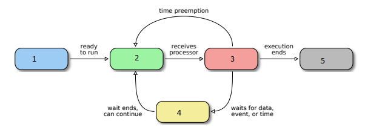

# Gestão de Tarefas

---

#### 1. Há uma tarefa neste estado para cada processador do sistema.

- [ ] Nova
- [ ] Pronta
- [ ] Executando
- [ ] Suspensa
- [x] Terminada

#### 2. Provavelmente o mais célebre exemplo real de ......... tenha ocorrido na sonda espacial Mars Pathfinder, enviada pela NASA em 1996 para explorar o solo do planeta Marte (Figura 7.3) [Jones, 1997]. O software da sonda executava sobre o sistema operacional de tempo real VxWorks e consistia de 97 threads com vários níveis de prioridades fixas. Complete a frase de forma correta:

- [x] Inversão de prioridades
- [ ] Herança de prioridade

#### 3. Assinale a alternativa que representa a classificação possível dos tipos de tarefas em realação ao seu comportamento temporal:

- [x] Tarefas de tempo real
- [ ] Tarefas em lote (batch)
- [ ] Tarefas orientadas a objetos
- [ ] Tarefas interativas
- [ ] Tarefas orientadas a processamento
- [ ] Tarefas orientadas a memoria
- [ ] Tarefas orientadas a entrada/saída

#### 4. Assinale as transições de estado de tarefas que não possíveis. (N: Nova, P: pronta, E: executando, S: suspensa, T: terminada).

- [ ] E ? P
- [x] E ? S
- [ ] S ? E
- [ ] P ? N
- [ ] S ? T
- [x] E ? T
- [x] N ? S
- [ ] P ? S

#### 5. Assinale a alternativa que representa corretamente o Diagrama de estados de uma tarefa em um sistema de tempo compartilhado

- [ ] 1) Nova,2)Executando, 3) Pronta, 4) Suspensa, 5)Terminada
- [x] 1) Nova, 2)Pronta, 3)Executando, 4) Suspensa, 5)Terminada
- [ ] 1) Nova, 2)Suspensa, 3)Executando, 4)Pronta, 5)Terminada
- [ ] 1)Terminada ,2)Executando, 3) Pronta, 4) Suspensa, 5)Nova

#### 6. O escalonador de um sistema operacional pode ser preemptivo ou cooperativo (não-preemptivo), assinale a alternativa que define um sistema preemptivos:

- [x] nestes sistemas uma tarefa pode perder o processador caso termine seu quantum de tempo, caso execute uma chamada de sistema ou caso ocorra uma interrupção que corde uma tarefa mais prioritária (que estava suspensa aguardando um evento). A cada interrupção, exceção ou chamada de sistema, o escalonador reavalia todas as tarefas a fila de prontas e decide se mantém ou substitui a tarefa atualmente em execução.
- [ ] a tarefa em execução permanece no processador tanto quanto possível, só liberando o mesmo caso termine de executar, solicite uma operação de entrada/saída ou libere explicitamente o processador , voltando à fila de tarefas prontas. Esses sistemas são chamados de cooperativos por exigir a cooperação das tarefas entre si na gestão do rocessador, para que todas possam executar.

#### 7. Descreve de froma simples o protocolo de herança de prioridade na gestão de tarefas?

O protocolo de herança de prioridade mais simples consiste em aumentar  emporariamente a prioridade da tarefa tb que detém o recurso de uso exclusivo R. Caso esse recurso seja requisitado por uma tarefa de maior prioridade ta , a tarefa tb “herda” temporariamente a prioridade de ta , para que possa executar e liberar o recurso R mais rapidamente. Assim que liberar o recurso, tb retorna à sua prioridade anterior.

#### 8. O que significa time sharing e qual a sua importância em um sistema operacional?

Time sharing é um método de compartilhamento de tempo de processador entre múltiplos usuários ou tarefas. Ele permite que vários processos executem concorrentemente em um sistema operacional, dividindo o tempo de CPU de forma justa entre eles. Isso é importante para garantir que cada usuário ou tarefa receba uma parcela justa de recursos de processamento, promovendo a multitarefa e a responsividade do sistema.

#### 9. Atualmente a maioria dos sistemas operacionais de uso geral é preemptiva. Sistemas mais antigos, como o Windows 3.*, PalmOS 3 e MacOS 8 e 9 operavam de forma cooperativa.

- [x] Verdadeiro	
- [ ] Falso

#### 10. O que são threads e para que servem?

Threads são unidades de execução leves que compartilham o mesmo espaço de memória e recursos de um processo, permitindo a execução simultânea de múltiplas partes do código de um programa. Elas servem para facilitar a execução concorrente e paralela de tarefas em um programa, melhorando a eficiência e responsividade do sistema.

#### 11. O ato de suspender uma tarefa e reativar outra é denominado uma troca de contexto.Nela o sistema operacional pode suspender e retomar a execução de tarefas de forma transparente (sem que as tarefas o percebam), é necessário definir operações para salvar o contexto atual de uma tarefa em seu TCB e restaurá-lo mais tarde no processador.

- [x] Verdadeiro	
- [ ] Falso

#### 12. O acesso a um semáforo em uso pode levar a tarefa a este estado.

- [ ] Nova
- [ ] Pronta
- [ ] Executando
- [x] Suspensa
- [ ] Terminada

#### 13. A tarefa vai a este estado ao terminar seu quantum:

- [ ] Pronta
- [ ] Nova
- [ ] Executando
- [ ] Suspensa
- [x] Terminada

#### 14. Assinale as principais vantagens de threads em relação a processos.

- [x] Uso Eficiente de Recursos
- [ ] Segurança e Estabilidade
- [x] Desempenho e Velocidade de Criação
- [x] Comunicação Mais Simples
- [ ] Lenta troca de contexto

#### 15. A inversão de prioridades na gestão de tarefas ocorre quando:

- [x] Uma tarefa de baixa prioridade é interrompida frequentemente para permitir que tarefas de alta prioridade sejam executadas.
- [ ] Todas as tarefas são tratadas com a mesma prioridade, eliminando qualquer forma de priorização.
- [ ] A inversão de prioridades acontece quando o sistema operacional falha em reconhecer e aplicar as prioridades definidas para as tarefas.
- [ ] Uma tarefa de alta prioridade voluntariamente cede seu tempo de processador para uma tarefa de menor prioridade.
- [ ] Uma tarefa de alta prioridade é impedida de executar por causa de uma tarefa de baixa prioridade.

#### 16. A chamada de sistema fork() é invocada por um processo, mas dois processos recebem seu retorno: o processo pai, que a invocou, e o processo filho, que acabou de ser criado e que possui um novo estado, diferente do estado interno que o pai.

- [x] Verdadeiro	
- [ ] Falso

#### 17. A duração do quantum depende muito do tipo de sistema operacional; no Linux ela varia de 10 a 200 milissegundos, dependendo do tipo e prioridade da tarefa

- [x] Verdadeiro	
- [ ] Falso